# Writeo System Architecture

**Version:** 2.0  
**Last Updated:** 2025  
**Architecture Pattern:** Serverless Edge Computing with ML-as-a-Service

**Live Services:**

- [Web Frontend](https://writeo.tre.systems) - Interactive essay submission interface
- [API Documentation](https://your-api-worker.workers.dev/docs) - Interactive Swagger UI (available at `/docs` endpoint)

---

## Table of Contents

1. [System Overview](#1-system-overview)
2. [Architecture Diagram](#2-architecture-diagram)
3. [Components & Technology](#3-components--technology)
4. [Data Flow](#4-data-flow)
5. [Storage Architecture](#5-storage-architecture)
6. [Performance & Costs](#6-performance--costs)

---

## 1. System Overview

Writeo provides comprehensive essay assessment:

- **Essay Scoring** - Multi-dimensional analysis (TA, CC, Vocab, Grammar, Overall) using ML models
- **AI Feedback** - Context-aware feedback using Groq (Llama 3.3 70B Versatile)
- **Grammar Checking** - LanguageTool integration with inline error annotations
- **Relevance Validation** - Fast embeddings-based answer relevance checking
- **CEFR Mapping** - Automatic conversion to A2-C2 proficiency levels
- **Scale-to-Zero** - Cost-effective serverless architecture

### Current Implementation (Free Tier)

The system uses **synchronous processing** - all assessment is completed before returning results:

**Processing Flow:**

```
Client → API Worker → [Essay Scoring + LanguageTool + Relevance Check (parallel)] → AI Feedback (with context) → KV Storage → Client (3-20s)
```

**Key Features:**

- Synchronous processing: Results returned immediately in PUT response body (typically 3-10s, max <20s)
- Parallel processing: All services run concurrently
- Streaming: Real-time AI feedback generation via Server-Sent Events (separate endpoint)
- Optimized: Combined LLM calls, parallelized R2 operations, model caching

---

## 2. Architecture Diagram

```mermaid
graph TB
    External[🔌 External System<br/>API Client] -->|HTTPS REST API| API[⚡ API Worker<br/>Cloudflare Workers]
    User[👤 End User] -->|Uses| Web[🌐 Web Frontend<br/>Next.js]

    Web -->|Server Actions| API

    API -->|Store/Retrieve| R2[(💾 R2 Storage<br/>Questions, Answers, Submissions)]
    API -->|Store/Retrieve| KV[(🗄️ KV Store<br/>Assessment Results)]
    API -->|POST /grade<br/>Parallel| Essay[🤖 Essay Scoring Service<br/>FastAPI + ML Models]
    API -->|POST /check<br/>Parallel| LT[📝 LanguageTool Service<br/>FastAPI + LanguageTool]
    API -->|Embeddings| RELEVANCE[🔍 Relevance Check<br/>Cloudflare AI Embeddings]

    Essay -->|Essay Scores| API
    LT -->|Grammar Errors| API
    RELEVANCE -->|Similarity Score| API
    API -->|With Context| AI[💬 AI Feedback<br/>Groq - Llama 3.3 70B]
    AI -->|Contextual Feedback| API

    style User fill:#e1f5ff
    style Web fill:#e1f5ff
    style External fill:#ffe1e1
    style API fill:#fff4e1
    style R2 fill:#e1ffe1
    style KV fill:#ffe1e1
    style Essay fill:#ffe1f5
    style LT fill:#e1f5ff
```



**Processing Flow:**

1. **End User** uses Web Frontend UI, OR **External System** calls API directly
2. **If `storeResults: true` (opt-in):** API Worker stores questions, answers, and submission in R2 (parallelized)
3. API Worker builds request from inline data (answers are always sent inline)
4. API Worker calls **services in parallel**:
   - Essay Scoring Service (`modal-essay`) for essay scoring
   - LanguageTool Service (`modal-lt`) for grammar checking
   - Relevance Check (Cloudflare AI embeddings) for fast relevance validation
5. API Worker merges results from parallel services
6. API Worker calls **AI Feedback** (Groq) with full context from Essay Scoring and LanguageTool results
7. API Worker merges results from all services (including AI feedback)
8. **If `storeResults: true` (opt-in):** Results stored in KV (90-day TTL)
9. Results returned to client immediately in PUT response body (typically 3-10s, max <20s)
10. **Default behavior:** Results stored only in browser localStorage (no server storage)

---

## 3. Components & Technology

### 3.1 Cloudflare Components

| Component           | Technology                  | Responsibility                                                       | Scale-to-Zero        |
| ------------------- | --------------------------- | -------------------------------------------------------------------- | -------------------- |
| **Web Frontend**    | Next.js 15+ (App Router)    | User interface, form handling, result display                        | ✅ Yes               |
| **API Worker**      | Cloudflare Workers          | REST API, request validation, data orchestration                     | ✅ Yes               |
| **R2 Storage**      | Cloudflare R2               | Persistent storage for questions, answers, submissions (opt-in only) | ❌ No (storage only) |
| **KV Store**        | Cloudflare KV               | Assessment results cache (90-day TTL, opt-in only)                   | ❌ No (storage only) |
| **Browser Storage** | localStorage/sessionStorage | Default storage location (client-side only)                          | ✅ Yes (client-side) |

### 3.2 Modal Services

| Service                   | Technology             | Responsibility                    | Scale-to-Zero |
| ------------------------- | ---------------------- | --------------------------------- | ------------- |
| **Essay Scoring Service** | FastAPI + PyTorch      | ML model inference, essay scoring | ✅ Yes        |
| **LanguageTool**          | FastAPI + LanguageTool | Grammar, spelling, style checking | ✅ Yes        |

### 3.3 Cloudflare Workers AI

| Service             | Technology            | Responsibility                                         | Scale-to-Zero |
| ------------------- | --------------------- | ------------------------------------------------------ | ------------- |
| **AI Feedback**     | Groq API              | Context-aware essay feedback (Llama 3.3 70B Versatile) | ✅ Yes        |
| **Relevance Check** | Cloudflare Workers AI | Fast embeddings-based relevance validation             | ✅ Yes        |

**AI Feedback:**

- Uses Groq with Llama 3.3 70B Versatile model (optimal for essay feedback)
- Receives full context from essay scores and LanguageTool errors
- Provides contextual, actionable feedback tailored to student's level
- Ultra-fast inference (~100-500ms) via Groq's LPU

**Relevance Check:**

- Uses embeddings model (`@cf/baai/bge-base-en-v1.5`)
- Fast cosine similarity calculation (~100-200ms)
- Cost-effective validation (~$0.0001 per check)

**Essay Scoring Service (`modal-essay`):**

- Uses `KevSun/Engessay_grading_ML` model (default)
  - Citation: Sun, K., & Wang, R. (2024). Automatic Essay Multi-dimensional Scoring with Fine-tuning and Multiple Regression. _ArXiv_. https://arxiv.org/abs/2406.01198
  - Well-suited for academic argumentative writing practice
  - Provides strong coverage of Coherence & Cohesion, Lexical Resource, and Grammatical Range & Accuracy
  - Task Achievement assessed separately via LLM feedback for comprehensive evaluation
- Multi-dimensional scoring: TA, CC, Vocab, Grammar, Overall
- CEFR level mapping (A2-C2)
- GPU/CPU inference with model caching

**LanguageTool Service (`modal-lt`):**

- Open-source grammar checker
- Detects grammar, spelling, and style errors
- Provides suggestions and corrections
- CPU-only (no GPU needed)
- Fast warm checks (~100-500ms)

### 3.3 API Worker Components


**Key Components:**

- **Submission Handler**: Orchestrates parallel calls to Essay Scoring and LanguageTool services
- **Result Merger**: Combines essay scores and grammar errors into unified response
- **R2/KV Clients**: Handle storage operations

---

## 4. Data Flow

### 4.1 Submission Processing Flow


### 4.2 Assessment Results Structure

**Merged Results Format:**

```json
{
  "status": "success",
  "results": {
    "parts": [
      {
        "part": 1,
        "status": "success",
        "assessor-results": [
          {
            "id": "T-AES-ESSAY",
            "name": "Essay scorer",
            "type": "grader",
            "overall": 6.5,
            "label": "B2",
            "dimensions": {
              "TA": 6.0,
              "CC": 6.5,
              "Vocab": 6.5,
              "Grammar": 6.0,
              "Overall": 6.5
            }
          },
          {
            "id": "T-GEC-LT",
            "name": "LanguageTool (OSS)",
            "type": "feedback",
            "errors": [
              {
                "start": 2,
                "end": 6,
                "length": 4,
                "category": "GRAMMAR",
                "rule_id": "SVA",
                "message": "Possible subject–verb agreement error.",
                "suggestions": ["go", "went"],
                "source": "LT",
                "severity": "error"
              }
            ],
            "meta": {
              "language": "en-GB",
              "engine": "LT-OSS",
              "errorCount": 1
            }
          }
        ]
      }
    ]
  },
  "template": { "name": "generic", "version": 1 },
  "meta": {
    "answerTexts": {
      "answer-id": "Original essay text..."
    }
  }
}
```

---

## 5. Storage Architecture

**Important:** Writeo uses an **opt-in server storage model**. By default (`storeResults: false`), no data is stored on servers. Results are stored only in the user's browser (localStorage). Server storage (R2/KV) is only used when `storeResults: true` is explicitly set.

### 5.1 Browser Storage (Default)

**Location:** Client-side localStorage/sessionStorage

| Storage Type     | Purpose                             | Retention                      |
| ---------------- | ----------------------------------- | ------------------------------ |
| `localStorage`   | Persistent results storage          | Until user clears browser data |
| `sessionStorage` | Temporary results during navigation | Until browser tab closes       |

**Access Patterns:**

- **Write**: Automatic after submission processing
- **Read**: Immediate access from browser
- **Privacy**: Data never leaves user's device

### 5.2 R2 Object Storage (Opt-in Only)

**Bucket:** `writeo-data`  
**Usage:** Only when `storeResults: true`

| Path Pattern                       | Content Type       | Structure                                    |
| ---------------------------------- | ------------------ | -------------------------------------------- |
| `questions/{question_id}.json`     | `application/json` | `{text: string}`                             |
| `answers/{answer_id}.json`         | `application/json` | `{question-id: string, answer-text: string}` |
| `submissions/{submission_id}.json` | `application/json` | `{submission: Part[], template: {}}`         |

**Access Patterns:**

- **Write**: Single PUT per resource creation (opt-in only)
- **Read**: Batch reads during submission processing (opt-in only)
- **TTL**: No automatic expiration (consider lifecycle policies)

### 5.3 KV Storage (Opt-in Only)

**Namespace:** `WRITEO_RESULTS`  
**Usage:** Only when `storeResults: true`

| Key Pattern                  | Value Type  | TTL                         |
| ---------------------------- | ----------- | --------------------------- |
| `submission:{submission_id}` | JSON string | 90 days (7,776,000 seconds) |

**Access Patterns:**

- **Write**: Single PUT after processing completes (opt-in only)
- **Read**: Single GET per client poll request (opt-in only)
- **Consistency**: Eventual consistency (read-after-write may have delay)

### 5.3 Data Size Estimates

| Resource Type      | Average Size | Max Size | Storage Location (Default) | Storage Location (Opt-in) |
| ------------------ | ------------ | -------- | -------------------------- | ------------------------- |
| Question           | ~100 bytes   | 1 KB     | Not stored                 | R2                        |
| Answer (essay)     | ~2 KB        | 50 KB    | Not stored                 | R2                        |
| Submission         | ~500 bytes   | 5 KB     | Not stored                 | R2                        |
| Assessment Results | ~1-5 KB      | 10 KB    | localStorage               | KV (90-day TTL)           |

---

## 6. Performance & Costs

### 6.1 Latency (Warm vs Cold)

| Step                                  | Warm (P50) | Cold      | Notes                                |
| ------------------------------------- | ---------- | --------- | ------------------------------------ |
| **PUT /text/submissions/{id}**        | ~0.94s     | 11.3s     | Includes parallel Modal calls        |
| **Modal POST /grade (Essay Scoring)** | ~0.13s     | 8.4-10.0s | GPU inference + model loading        |
| **Modal POST /check (LanguageTool)**  | ~0.1-0.5s  | 2-3s      | CPU-only, JAR download on cold start |
| **GET /text/submissions/{id}**        | 6ms        | n/a       | KV read                              |
| **End-to-end (user experience)**      | ~1.8-2.0s  | ~11s      | Full submission → results visible    |

**Bottleneck Analysis:**

- **Primary bottleneck**: AI Feedback generation (13-18 seconds per answer)
- **Secondary bottleneck**: Modal cold starts (8-15s for Essay Scoring, 2-5s for LanguageTool)
- **R2 Operations**: Already parallelized using `Promise.all()` for optimal performance

### 6.2 Throughput

| Metric                   | Value                                   |
| ------------------------ | --------------------------------------- |
| **Max Requests per Day** | 100,000 (free tier limit)               |
| **Concurrent Requests**  | Unlimited (auto-scales per request)     |
| **Average Requests/sec** | ~1.2 requests/second (100k/day average) |
| **Burst Capacity**       | Handles traffic spikes automatically    |

### 6.3 Cost Estimates

**Free Tier (Monthly Estimates):**

| Service                         | Free Tier         | Monthly Cost          |
| ------------------------------- | ----------------- | --------------------- |
| **Cloudflare Workers**          | 100k requests/day | $0.00                 |
| **Cloudflare Workers AI**       | 10k requests/day  | $0.00                 |
| **Cloudflare R2 Storage**       | 10 GB free        | $0.00                 |
| **Cloudflare KV Storage**       | 100 MB free       | $0.00                 |
| **Groq API**                    | Pay-per-use       | ~$0.01 per request    |
| **Modal Essay Scoring Service** | Pay-per-use       | ~$0.10-1.00/month     |
| **Modal LanguageTool**          | Pay-per-use       | ~$0.01-0.10/month     |
| **Total**                       | -                 | **~$0.12-1.15/month** |

**Notes:**

- Scale-to-zero: No idle costs for Workers or Modal services
- Storage: Only charged for data stored (generous free tiers)
- Groq API: Dominant cost driver for AI feedback (~$0.01 per request)
- See [OPERATIONS.md](OPERATIONS.md) for detailed cost breakdown

### 6.4 Performance Optimizations Implemented

**Current Optimizations:**

1. ✅ **Parallelized R2 Operations** - All R2 reads/writes use `Promise.all()`
2. ✅ **Parallel Service Calls** - Essay Scoring, LanguageTool, and Relevance checks run concurrently
3. ✅ **Combined AI Feedback Calls** - Single LLM call per answer (50% fewer API calls)
4. ✅ **Model Caching** - Modal Volume caches model weights for faster cold starts
5. ✅ **Synchronous Processing** - Results returned immediately in PUT response body (typically 3-10s)

**Future Optimization Opportunities:**

- Modal Keep-Warm Strategy - Reduce cold starts (5-15 min warm window)
- AI Feedback Caching - Cache feedback for similar answers
- Pre-fetch Common Questions - Cache frequently used questions in KV

---

## Appendix: Technology Stack Details

### Frontend Stack

- **Framework**: Next.js 15+ (App Router)
- **Language**: TypeScript 5+
- **Styling**: CSS Modules
- **API Client**: Server Actions (server-side only)

### API Worker Stack

- **Runtime**: Cloudflare Workers
- **Framework**: Hono 4+
- **Language**: TypeScript 5+
- **Storage**: R2 API, KV API

### Modal Services Stack

- **Platform**: Modal (serverless ML)
- **Framework**: FastAPI 0.104+
- **Language**: Python 3.11+
- **ML Framework**: PyTorch 2.1.0+
- **Models**: HuggingFace Transformers 4.40+
- **Grammar**: LanguageTool 6.4+

---

**Document Status:** ✅ Current  
**Last Updated:** 2025-01-16
