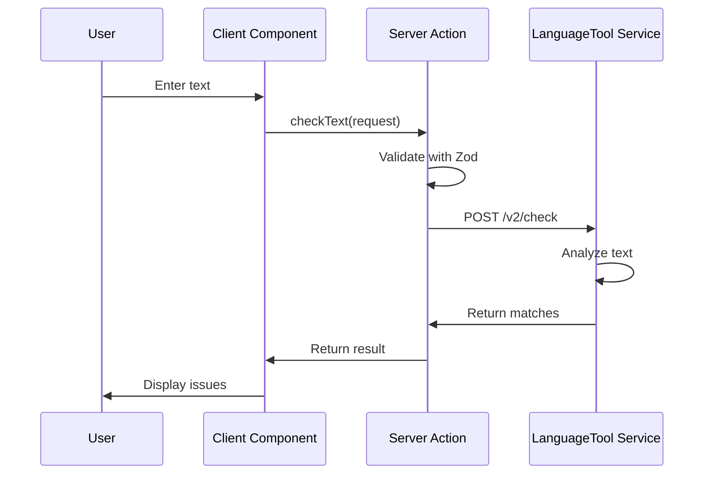

# Architecture Overview

## System Architecture

Writeo is built as a modern, scalable writing assistant application using AWS cloud services and serverless architecture patterns.

### High-Level Architecture

```
┌─────────────────┐    ┌──────────────────┐    ┌─────────────────┐
│   Next.js App   │    │   Amplify Gen 2  │    │   ECS Service   │
│                 │    │                  │    │                 │
│ - React UI      │───▶│ - Authentication │    │ - LanguageTool  │
│ - Server Actions│    │ - GraphQL API    │    │ - Docker Image  │
│ - TypeScript    │    │ - Custom CDK     │───▶│ - Health Checks │
└─────────────────┘    └──────────────────┘    └─────────────────┘
        │                        │                        │
        │                        │                        │
        ▼                        ▼                        ▼
┌─────────────────┐    ┌──────────────────┐    ┌─────────────────┐
│   CloudFront    │    │      Lambda      │    │   Application   │
│   Distribution  │    │    Functions     │    │ Load Balancer   │
└─────────────────┘    └──────────────────┘    └─────────────────┘
```

## Components

### Frontend Layer

#### Next.js Application

- **Framework**: Next.js 15 with App Router
- **UI Library**: React 19 with Tailwind CSS
- **State Management**: Zustand for client-side state
- **Type Safety**: TypeScript with Zod schemas
- **Server Actions**: Direct server-side function calls

#### Key Features

- Server-side rendering (SSR)
- Static site generation (SSG) where applicable
- Optimized bundling with Turbopack
- Automatic code splitting

### Backend Layer

#### AWS Amplify Gen 2

- **Authentication**: AWS Cognito integration
- **API**: GraphQL with AWS AppSync
- **Custom Resources**: CDK constructs for ECS service
- **Environment Management**: Automatic configuration injection

#### ECS Service Architecture

```
┌─────────────────────────────────────────────────────────────┐
│                    Minimal VPC                             │
│  ┌─────────────────┐              ┌─────────────────┐      │
│  │  Public Subnet  │              │ Public Subnet   │      │
│  │                 │              │                 │      │
│  │ ┌─────────────┐ │              │ ┌─────────────┐ │      │
│  │ │ Service     │ │              │ │ ECS Service │ │      │
│  │ │ Discovery   │ │──────────────▶│ │ (Port 8081) │ │      │
│  │ └─────────────┘ │              │ └─────────────┘ │      │
│  │                 │              │                 │      │
│  │ ┌─────────────┐ │              │ ┌─────────────┐ │      │
│  │ │ Internet    │ │              │ │ Security    │ │      │
│  │ │ Gateway     │ │              │ │ Group       │ │      │
│  │ └─────────────┘ │              │ └─────────────┘ │      │
│  └─────────────────┘              └─────────────────┘      │
└─────────────────────────────────────────────────────────────┘
```

### Service Layer

#### LanguageTool Service

- **Container**: Official LanguageTool Docker image (`meyay/languagetool:latest`)
- **Runtime**: Java 21 JRE optimized for container usage
- **Resources**: 1 vCPU, 2GB RAM (configurable)
- **Port**: 8081 (current default)
- **Access**: Service Discovery via `languagetool.languagetool.local:8081`

#### Service Configuration

```yaml
Container Specifications:
  Image: meyay/languagetool:latest
  Port: 8081
  Environment:
    JAVA_TOOL_OPTIONS: '-Xms1g -Xmx1800m'

Health Check:
  Command: curl -f http://localhost:8081/v2/check?text=test
  Interval: 30s
  Timeout: 5s
  Retries: 3
  Start Period: 60s

Service Discovery:
  Namespace: languagetool.local
  Service Name: languagetool
  DNS: languagetool.languagetool.local:8081
```

## Data Flow

### Text Analysis Flow

1. **User Input**: Text entered in React component
2. **Server Action**: Next.js server action invoked
3. **Validation**: Zod schema validation on request
4. **API Call**: HTTP request to LanguageTool service
5. **Processing**: LanguageTool analyzes text
6. **Response**: Results returned through server action
7. **UI Update**: React component displays results



## Infrastructure as Code

### CDK Constructs

The ECS service is defined using AWS CDK constructs:

```typescript
// Key infrastructure components
- VPC with public/private subnets
- ECS Cluster with Fargate capacity
- Application Load Balancer (internal)
- Task Definition with container spec
- Service with desired count and health checks
- CloudWatch Log Group for monitoring
```

### Security Model

#### Network Security

- **Minimal VPC**: Creates dedicated VPC with public subnets only (no NAT gateways)
- **Security Groups**: Only allow VPC traffic to LanguageTool port (8081)
- **Service Discovery**: Internal DNS resolution (`languagetool.languagetool.local`)
- **No Public ALB**: Direct service-to-service communication via service discovery

#### Application Security

- **Authentication**: AWS Cognito integration
- **Authorization**: IAM roles and policies
- **Input Validation**: Zod schemas prevent malformed requests
- **Error Handling**: Graceful degradation on service failures

## Performance Considerations

### Optimization Strategies

#### Frontend

- **Code Splitting**: Automatic with Next.js
- **Image Optimization**: Next.js Image component
- **Caching**: Static assets cached by CloudFront
- **Prefetching**: Critical resources prefetched

#### Backend

- **Connection Pooling**: Reuse HTTP connections
- **Request Batching**: Multiple checks in single request
- **Caching**: Response caching for repeated requests
- **Auto Scaling**: ECS service scales based on demand

### Monitoring and Observability

#### Metrics

- **Application Metrics**: Response times, error rates
- **Infrastructure Metrics**: CPU, memory, network usage
- **Custom Metrics**: Text processing statistics

#### Logging

- **Application Logs**: Structured JSON logging
- **Container Logs**: CloudWatch Logs integration
- **Access Logs**: ALB access logs for debugging

## Scalability

### Horizontal Scaling

- **ECS Service**: Auto-scaling based on CPU/memory
- **Task Placement**: Distributed across availability zones
- **Load Balancing**: Even distribution of requests

### Vertical Scaling

- **Task Resources**: CPU and memory configurable
- **Container Optimization**: JVM tuning for memory efficiency
- **Database Connections**: Connection pooling and optimization

## Deployment Strategy

### Environment Promotion

1. **Development**: Amplify sandbox environment
2. **Staging**: Feature branch deployment
3. **Production**: Main branch with approval gates

### Blue-Green Deployment

- ECS service updates use rolling deployment
- Zero-downtime deployments with health checks
- Automatic rollback on failure detection

## Cost Optimization

### Resource Efficiency

- **Default VPC**: No VPC creation costs
- **No NAT Gateway**: Saves ~$45/month per gateway
- **Right-sizing**: Minimal resources for development
- **Spot Instances**: Consider for non-critical workloads
- **Reserved Capacity**: Long-term cost savings
- **Auto-scaling**: Scale down during low usage

### Monitoring Costs

- **AWS Cost Explorer**: Track spending by service
- **Budget Alerts**: Notifications for cost thresholds
- **Resource Tagging**: Detailed cost attribution
