# Writeo System Architecture

**Version:** 2.1
**Architecture Pattern:** Serverless Edge Computing with ML-as-a-Service

**Live Services:**

- [Web Frontend](https://writeo.tre.systems) - Interactive essay submission interface
- [API Documentation](https://writeo-api-worker.rob-gilks.workers.dev/docs) - Interactive Swagger UI (available at `/docs` endpoint)

---

## Table of Contents

1. [System Overview](#1-system-overview)
2. [Architecture Diagram](#2-architecture-diagram)
3. [Components & Technology](#3-components--technology)
4. [Data Flow](#4-data-flow)
5. [Storage Architecture](#5-storage-architecture)
6. [Performance](#6-performance)

---

## 1. System Overview

Writeo provides comprehensive essay assessment through a modular **Service Registry** architecture:

- **Essay Scoring**:
  - **Corpus Scorer (`AES-CORPUS`)**: High-correlation scorer trained on the Write & Improve corpus.
  - **DeBERTa Scorer (`AES-DEBERTA`)**: Deep learning model for dimensional scoring (Task Achievement, Coherence, Vocabulary, Grammar).
  - **Standard Scorer (`AES-ESSAY`)**: Legacy baseline scorer.
- **Grammar Correction (GEC)**:
  - **Seq2Seq GEC (`GEC-SEQ2SEQ`)**: Transformer-based correction (high precision, slower).
  - **GECToR (`GEC-GECTOR`)**: Iterative sequence tagging (fast, good precision).
  - **LanguageTool (`GEC-LT`)**: Rule-based checking for mechanics and typos.
- **AI Feedback**: Context-aware feedback using LLMs (OpenAI or Groq).
- **Relevance Checking**: Automated answer relevance validation using embeddings.

### Operational Profiles

Writeo is highly configurable via environment variables and `assessors.json`. While highly granular, we typically deploy in two primary profiles:

#### 🪙 "Cheap" Profile (Cost-Optimized)

**Configuration:**

- **LLM Provider:** `openai` (GPT-4o-mini)
- **Services:** Scale-to-zero enabled
- **Assessors:** `AES-CORPUS` (fast), `GEC-GECTOR` (fast), `GEC-LT` (very fast)

**Characteristics:**

- **Low Cost**: Minimal idle costs, cheap inference.
- **Higher Latency**: Cold starts (8-15s) on first request after inactivity.

#### ⚡ "Turbo" Profile (Performance-Optimized)

**Configuration:**

- **LLM Provider:** `groq` (Llama 3.3 70B)
- **Services:** Keep-warm enabled (min instances > 0)
- **Assessors:** `AES-DEBERTA` (high accuracy), `GEC-SEQ2SEQ` (best corrections), `GEC-LT`

**Characteristics:**

- **Ultra-Low Latency**: ~2-4s end-to-end latency.
- **Higher Quality**: Uses larger, more powerful models.
- **Higher Cost**: Paying for idle GPU time and high-performance LLM tokens.

---

## 2. Architecture Diagram

```mermaid
graph TB
    Client[👤 User / 🔌 API Client] -->|HTTPS REST| API[⚡ API Worker<br/>Cloudflare Workers]

    subgraph "Storage Layer"
        R2[(💾 R2 Storage)]
        KV[(🗄️ KV Store)]
    end

    subgraph "Assessment Services (Modal)"
        direction TB
        Corpus[🤖 Corpus Scorer]
        Deberta[🧠 DeBERTa Scorer]
        GEC[✍️ GEC Service]
        LT[📝 LanguageTool]
    end

    subgraph "AI Services"
        LLM[💬 LLM Feedback<br/>OpenAI / Groq]
        Rel[🔍 Relevance Check<br/>Cloudflare AI]
    end

    API -->|Store & Load| R2
    API -->|Cache Results| KV

    API -->|Parallel Execution| Corpus
    API -->|Parallel Execution| Deberta
    API -->|Parallel Execution| GEC
    API -->|Parallel Execution| LT
    API -->|Parallel Execution| Rel

    API -->|Contextual Feedback| LLM
```

---

## 3. Components & Technology

### 3.1 Cloudflare Components

| Component        | Technology         | Responsibility                                 |
| ---------------- | ------------------ | ---------------------------------------------- |
| **Web Frontend** | Next.js 15+        | UI, State Management (Zustand), PWA features   |
| **API Worker**   | Cloudflare Workers | Request handling, Service Orchestration (Hono) |
| **R2 Storage**   | Cloudflare R2      | Object storage (Essays, Questions)             |
| **KV Store**     | Cloudflare KV      | Result caching (90-day TTL)                    |

### 3.2 Modal Services (ML-as-a-Service)

Writeo uses [Modal](https://modal.com) to host Python-based ML services.

| Service ID      | Model / Engine      | Description                                             | Type       |
| :-------------- | :------------------ | :------------------------------------------------------ | :--------- |
| **AES-CORPUS**  | RoBERTa-base        | Trained on W&I Corpus. High correlation with human CEFR | **Scorer** |
| **AES-DEBERTA** | DeBERTa-v3-large    | Multi-dimensional scoring (TA, CC, Vocab, Grammar)      | **Scorer** |
| **AES-ESSAY**   | RoBERTa-base        | Legacy baseline scorer                                  | **Scorer** |
| **GEC-SEQ2SEQ** | Flan-T5-base-gec    | Sequence-to-sequence grammar correction (Best Quality)  | **GEC**    |
| **GEC-GECTOR**  | GECToR-RoBERTa      | Fast iterative tagging correction (High Speed)          | **GEC**    |
| **GEC-LT**      | LanguageTool (Java) | Rule-based checking for mechanics/typos                 | **GEC**    |

### 3.3 LLM Providers

Configured via `LLM_PROVIDER` env var:

- **OpenAI**: Uses `gpt-4o-mini` (default). Reliable, cost-effective.
- **Groq**: Uses `llama-3.3-70b-versatile`. Extremely fast inference (~100-300ms).

---

## 4. Data Flow

### 4.1 Submission Processing

---

## 5. Storage Architecture

**Default: Privacy-First**
By default (`storeResults: false`), Writeo operates in a stateless manner. No data is stored on R2 or KV. Results are returned to the client and stored in `localStorage`.

**Opt-in: Server Storage**
When `storeResults: true` is sent:

1.  **R2**: Stores the raw submission, questions, and answers (`writeo-data-1`).
2.  **KV**: Stores the processing result with a 90-day TTL (`WRITEO_RESULTS`).

---

## 6. Performance

### 6.1 Latency Benchmarks (Warm)

| Service Type     | Typical Latency | Notes                                            |
| ---------------- | :-------------- | :----------------------------------------------- |
| **API Overhead** | < 50ms          | Cloudflare Workers routing & validation          |
| **Corpus/Essay** | ~200ms          | Fast inference (RoBERTa)                         |
| **DeBERTa**      | ~400-800ms      | Heavy model, requires GPU                        |
| **LanguageTool** | ~200ms          | CPU-based, highly optimized                      |
| **GECToR**       | ~1.5s           | Fast neural GEC                                  |
| **Seq2Seq GEC**  | ~12-16s         | Slow generation (Beam search) - **Bottleneck**   |
| **LLM Feedback** | ~1-3s           | Depends on provider (Groq is faster than OpenAI) |

**Note**: Total request time is determined by the _slowest_ parallel service. If `GEC-SEQ2SEQ` is enabled, the request will take ~15s. If only `GEC-GECTOR` and `AES-CORPUS` are enabled, it can be < 3s.

### 6.2 Throughput

- **API**: Scales automatically with Cloudflare Workers.
- **Modal**: Autoscales containers up to configured limits (typically 10-100 concurrent containers).
- **LLM**: Subject to provider rate limits (TPM/RPM).
